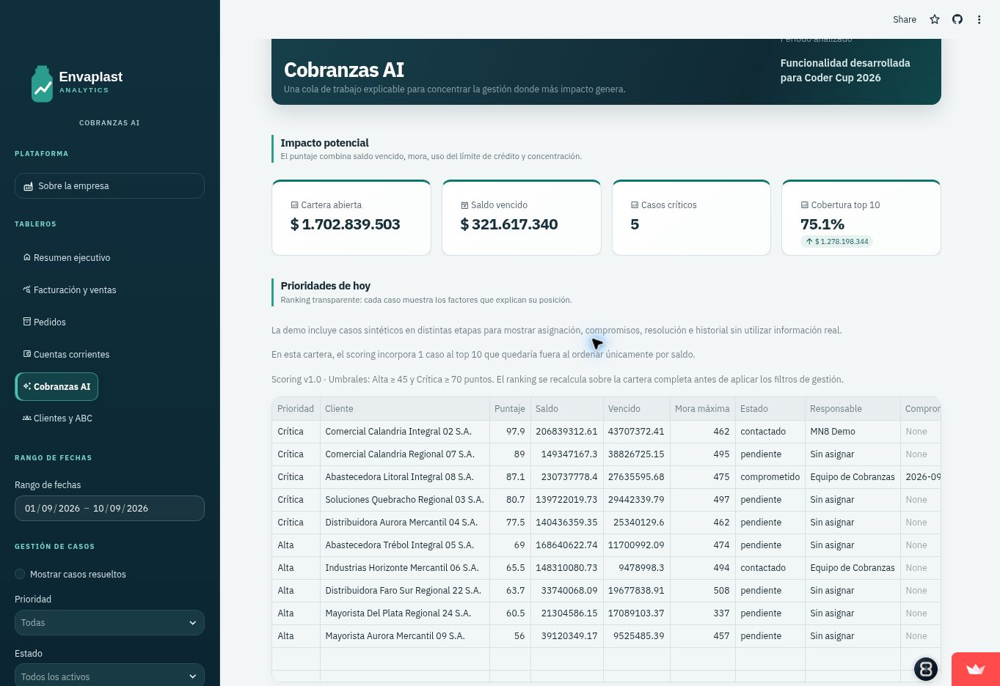

# Envaplast Cobranzas AI

> **De una cartera dispersa a una prioridad clara de gestión.**

[🚀 Ver demo en vivo](https://codercup-cobranzas-ai.streamlit.app/)

**Estado:** release candidate funcional · cierre Portfolio Ready v1.0.

Envaplast Cobranzas AI convierte una cartera abierta en una cola de trabajo explicable: prioriza clientes, muestra las señales que sostienen el ranking, recomienda el siguiente paso y genera un borrador editable. La decisión y el contacto permanecen siempre bajo revisión humana.

El proyecto utiliza el contexto comercial y los datos sintéticos de [Envaplast Analytics](https://github.com/mnoero23/envaplast-analytics), pero la experiencia de cobranzas, el scoring y el flujo de gestión fueron desarrollados específicamente para la competencia.

> Envaplast, sus clientes, documentos y operaciones son ficticios. No representan personas ni empresas reales.



## El problema

Cuando la cartera se gestiona entre planillas y sistemas separados, ordenar solo por saldo o por días de mora puede enfocar el esfuerzo en cuentas de bajo impacto. Una PyME necesita responder rápidamente:

- ¿A qué cliente conviene contactar primero?
- ¿Qué señales explican esa prioridad?
- ¿Qué acción corresponde realizar hoy?
- ¿Cómo preparar el contacto sin perder el control humano?

## La solución

El MVP propone un flujo simple:

1. **Entender** la exposición total y vencida.
2. **Priorizar** clientes con un scoring auditable.
3. **Explicar** por qué cada cuenta aparece en esa posición.
4. **Recomendar** el siguiente paso de gestión.
5. **Preparar** un borrador editable.
6. **Gestionar** responsables, estados, notas y compromisos de pago.
7. **Revisar** antes de cualquier comunicación y conservar la trazabilidad.

## Flujo principal

### 1. Impacto potencial

La pantalla resume cartera abierta, saldo vencido, casos críticos y cobertura monetaria del top 10.

### 2. Prioridades de hoy

Las facturas abiertas se agrupan por cliente y se ordenan mediante cuatro factores:

| Factor | Peso máximo |
|---|---:|
| Saldo vencido relativo | 35 |
| Días máximos de mora | 25 |
| Uso del límite de crédito | 20 |
| Concentración de cartera | 20 |

El resultado se clasifica como **Crítica**, **Alta** o **Seguimiento**.

### 3. Asistente de gestión

Para cada cliente seleccionado se presentan:

- prioridad y puntaje;
- señales explicativas;
- acción recomendada;
- borrador editable y descargable.

La gestión se completa con responsable, estado, nota, compromiso de pago e historial. Los
casos resueltos salen de la cola activa sin perder su trazabilidad.

## Qué significa “AI” en este MVP

El scoring actual es **determinístico, transparente y basado en reglas**. No es un modelo predictivo, no estima una probabilidad de cobro y no fue entrenado con datos históricos.

La propuesta de inteligencia asistida está en combinar señales, explicar la recomendación y preparar una acción revisable. Esta distinción evita presentar una regla de negocio como si fuera machine learning.

La fórmula, sus límites y el alcance futuro están documentados en [Definición de producto](docs/product-definition.md).

## Human-in-the-loop

El sistema deliberadamente:

- no envía correos ni mensajes;
- no bloquea cuentas;
- no modifica límites de crédito;
- no decide condiciones comerciales;
- no oculta los factores del ranking.

La persona responsable puede incorporar acuerdos, reclamos o documentación pendiente antes de actuar.

## Caso de negocio

Una PyME con una cartera extensa necesita decidir dónde concentrar las horas disponibles del
equipo. Cobranzas AI compara exposición, mora, utilización de crédito y concentración; luego
convierte esa prioridad en una gestión asignable y auditable.

La demo incluye casos sintéticos contactados, comprometidos y resueltos. El caso completo,
las decisiones y el impacto esperado se encuentran en [Caso de negocio](docs/business-case.md).

## Capacidades técnicas

- Python, Pandas y SQLAlchemy.
- Aplicación Streamlit y visualizaciones Plotly.
- Modelo relacional compatible con SQLite/PostgreSQL.
- Datos sintéticos reproducibles.
- Generación determinística, transaccional e idempotente.
- 19 pruebas automatizadas sobre datos, scoring, casos límite y gestión.
- Controles automáticos de calidad de datos.

## Alcance actual

### Entregado

- ranking de clientes;
- scoring de 0 a 100;
- explicaciones y acciones recomendadas;
- KPIs de cartera y cobertura;
- borrador editable y descargable;
- estado de gestión, responsable y notas por cliente;
- compromiso de pago y trazabilidad de cambios;
- filtros por prioridad, estado y responsable;
- demo pública;
- pruebas automatizadas.

### Cierre pendiente para v1.0

- video demostrativo actualizado;
- verificación visual final en escritorio y móvil;
- release pública `v1.0.0`.

El backlog priorizado está en [Roadmap](docs/roadmap.md).

## Arquitectura

```text
Datos sintéticos reproducibles
            │
            ▼
    Cartera de facturas
            │
            ▼
 Agregación por cliente
            │
            ▼
 Scoring + explicación
            │
            ▼
 Cola priorizada y gestión
            │
            ▼
 Historial + revisión humana
```

## Ejecutar localmente

Requiere Python 3.12.

```powershell
python -m venv .venv
.venv\Scripts\Activate.ps1
python -m pip install -e ".[dev]"
Copy-Item .env.example .env
python scripts/init_db.py --months 18
streamlit run app/app.py
```

## Validación

```powershell
pytest
ruff check .
ruff format --check .
python scripts/validate_data.py
```

Estado verificado del release candidate:

- 19 pruebas aprobadas;
- Ruff y formato aprobados;
- 8/8 controles de calidad;
- inicialización determinística e idempotente;
- demo pública con persistencia verificada.

## Origen

El producto nació como entrega independiente para Coder Cup 2026 y evolucionó hasta incorporar
gestión persistente, trazabilidad y una narrativa de negocio propia. El recorrido actualizado
está disponible en [Guion de video](docs/video-script.md) y
[Recorrido demostrativo](docs/demo-walkthrough.md).

## Sobre mí

Soy Matías Noero. Transformo información compleja en herramientas simples que ayudan a comprender el negocio y tomar mejores decisiones.

[GitHub](https://github.com/mnoero23) · [LinkedIn](https://www.linkedin.com/in/matias-noero-samper/)
